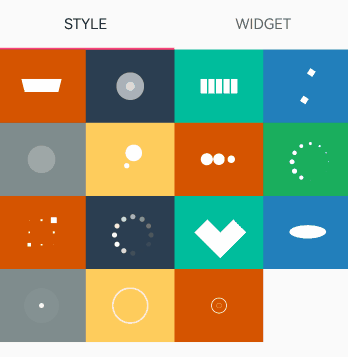
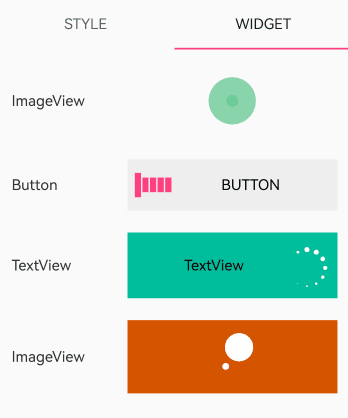

# SpinKit

## 简介

> SpinKit加载动画([SpinKit](https://tobiasahlin.com/spinkit)的鸿蒙版本实现)
> 。本库基于[Android-SpinKit](https://github.com/ybq/Android-SpinKit)原库进行适配，使其可以运行在 OpenHarmony，并沿用其现有用法和特性。

STYLE样式：



WIDGET效果：



DETAIL页效果:


## 下载安装

```shell
ohpm install @ohos/spinkit
```

OpenHarmony ohpm
环境配置等更多内容，请参考[如何安装 OpenHarmony ohpm 包](https://gitcode.com/openharmony-tpc/docs/blob/master/OpenHarmony_har_usage.md)

## 使用说明

通过SpinKit实现多种加载动画效果，分别是：

```tsx
export enum Style {
  /** 平面旋转动画 */
  ROTATING_PLANE = 0,
  /** 双弹跳动画 */
  DOUBLE_BOUNCE = 1,
  /** 波浪动画 */
  WAVE = 2,
  /** 流浪立方体 */
  WANDERING_CUBES = 3,
  /** 脉冲动画 */
  PULSE = 4,
  /** 追逐点动画 */
  CHASING_DOTS = 5,
  /** 三弹跳动画 */
  THREE_BOUNCE = 6,
  /** 渐隐+缩放环形加载动画 */
  CIRCLE = 7,
  /** 立方体网格动画 */
  CUBE_GRID = 8,
  /** 渐隐环形加载动画 */
  FADING_CIRCLE = 9,
  /** 折叠立方体动画 */
  FOLDING_CUBE = 10,
  /** 旋转圆动画 */
  ROTATING_CIRCLE = 11,
  /** 多脉冲动画 */
  MULTIPLE_PULSE = 12,
  /** 脉冲环动画 */
  PULSE_RING = 13,
  /** 多脉冲环动画 */
  MULTIPLE_PULSE_RING = 14,
}
```

导入并使用

 ```tsx
import { SizeStyle, SpinKitView, Style } from "@ohos/spinkit"

...

build() {
    Column() {
       SpinKitView({ mStyle: Style.WANDERING_CUBES, mColor: '#ff8900ff', mSize: SizeStyle.LARGE })
    }
    .width('100%')
    .height('100%')
  }
 ```

更多详细用法请参考开源库sample页面的实现

## 接口说明

SpinKitView({mStyle?:Style,mColor?:ResourceColor,mSize?:SizeStyle \| number})

创建SpinKitView加载动画。

| **名称** | 类型                  | **必填** | **说明**                                                                                                                                        |
|--------|---------------------|:------:|-----------------------------------------------------------------------------------------------------------------------------------------------|
| mStyle | Style               |   否    | 枚举样式类型， Style.ROTATING_PLANE、 Style.DOUBLE_BOUNCE、 Style.WAVE、 Style.WANDERING_CUBES、 Style.PULSE等                                            |
| mColor | ResourceColor       |   否    | SpinKit的颜色，默认"#333"深灰色                                                                                                                        |
| mSize  | SizeStyle \| number |   否    | 设置SpinKit的大小，接受SizeStyle和number两种数据类型。<br />SizeStyle：枚举样式类型，SizeStyle.SMALL、SizeStyle.LARGE、SizeStyle.NORMAL，默认值SizeStyle.NORMAL，大小40。<br /> |

Style枚举说明

动画样式枚举

| 名称                  | 值  | 说明          |
|---------------------|----|-------------|
| ROTATING_PLANE      | 0  | 平面旋转动画      |
| DOUBLE_BOUNCE       | 1  | 双弹跳动画       |
| WAVE                | 2  | 波浪动画        |
| WANDERING_CUBES     | 3  | 流浪立方体动画     |
| PULSE               | 4  | 脉冲动画        |
| CHASING_DOTS        | 5  | 追逐点动画       |
| THREE_BOUNCE        | 6  | 三弹跳动画       |
| CIRCLE              | 7  | 渐隐+缩放环形加载动画 |
| CUBE_GRID           | 8  | 立方体网格动画     |
| FADING_CIRCLE       | 9  | 渐隐环形加载动画    |
| FOLDING_CUBE        | 10 | 折叠立方体动画     |
| ROTATING_CIRCLE     | 11 | 旋转圆动画       |
| MULTIPLE_PULSE      | 12 | 多脉冲动画       |
| PULSE_RING          | 13 | 脉冲环动画       |
| MULTIPLE_PULSE_RING | 14 | 多脉冲环动画      |

SizeStyle枚举说明

动画尺寸枚举

| 名称   | 值     | 说明               |
| ------ | ------ | ------------------ |
| SMALL  | small  | 小尺寸。大小24vp   |
| NORMAL | normal | 默认尺寸。大小40vp |
| LARGE  | large  | 大尺寸。大小64vp   |

## 关于混淆

代码混淆，请查看[代码混淆简介](https://docs.openharmony.cn/pages/v5.0/zh-cn/application-dev/arkts-utils/source-obfuscation.md)

- 如果希望SpinKit库在代码混淆过程中不会被混淆，需要在混淆规则配置文件obfuscation-rules.txt中添加相应的排除规则：

```
-keep
./oh_modules/@ohos/spinkit
```

## 约束与限制

在下述版本验证通过：

- DevEco Studio 5.1.1 Release, SDK: API12 Release(5.0.0.66)

## 目录结构

````
|---- SpinKit  
|     |---- entry               # 示例代码文件夹   
|     |---- library             # SpinKit库文件夹
|	  |     |---- Index.ets		# 对外接口
|     |     |---- src  
|     |     |     |---- main  
|     |     |           |---- ets  
|     |     |           |     |---- components      # 核心组件实现  
|     |     |           |     |     |---- ChasingDots.ets  
|     |     |           |     |     |---- Circle.ets  
|     |     |           |     |     |---- CubeGrid.ets  
|     |     |           |     |     |---- DoubleBounce.ets  
|     |     |           |     |     |---- FadingCircle.ets  
|     |     |           |     |     |---- FoldingCube.ets  
|     |     |           |     |     |---- MultiplePulse.ets  
|     |     |           |     |     |---- MultiplePulseRing.ets  
|     |     |           |     |     |---- Pulse.ets  
|     |     |           |     |     |---- PulseRing.ets  
|     |     |           |     |     |---- RotatingCircle.ets  
|     |     |           |     |     |---- RotatingPlane.ets  
|     |     |           |     |     |---- ThreeBounce.ets  
|     |     |           |     |     |---- WanderingCubes.ets  
|     |     |           |     |     |---- Wave.ets  
|     |     |           |     |---- constants       # 库常量定义  
|     |     |           |     |     |---- CommonConstants.ets       # 公共常量定义  
|     |     |           |     |     |---- DelayConstant.ets         # 延迟常量定义  
|     |     |           |     |     |---- DurationConstant.ets      # 持续时间常量定义  
|     |     |           |     |     |---- OpacityConstant.ets       # 透明度常量定义  
|     |     |           |     |---- model           # 数据模型  
|     |     |           |     |     |---- SpinKit.ets  
|     |     |           |     |     |---- Style.ets  
|     |     |           |     |---- view            # 视图层  
|     |     |           |     |     |---- SpinKitView.ets  # 对外暴露的SpinKit视图组件  
|     |     |           |     └─--- viewmodel       # 视图模型   
|     |     |           |           |---- SpinKitVM.ets   
|     |     |           └─ resources                # 库资源文件（图片、样式等） 
|     |---- README.md           # 英文安装使用方法  
|     |---- README_zh.md        # 中文安装使用方法  
````

## 贡献代码

使用过程中发现任何问题都可以提 [Issue]( https://gitcode.com/openharmony-sig/ohos_spin_kit/issues)
给组件，当然，也非常欢迎发 [PR]( https://gitcode.com/openharmony-sig/ohos_spin_kit/pulls)共建 。

## 开源协议

本项目基于 [Apache License 2.0]( https://gitcode.com/openharmony-sig/ohos_spin_kit/blob/master/LICENSE)
，请自由地享受和参与开源。

